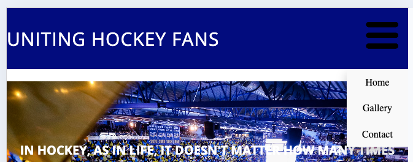
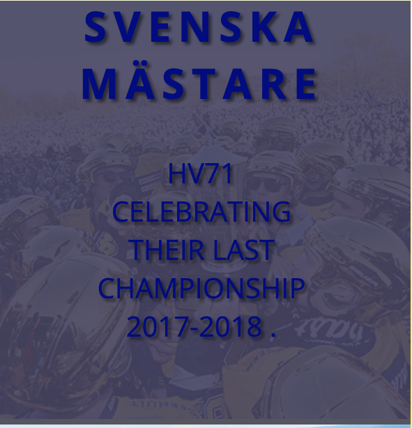
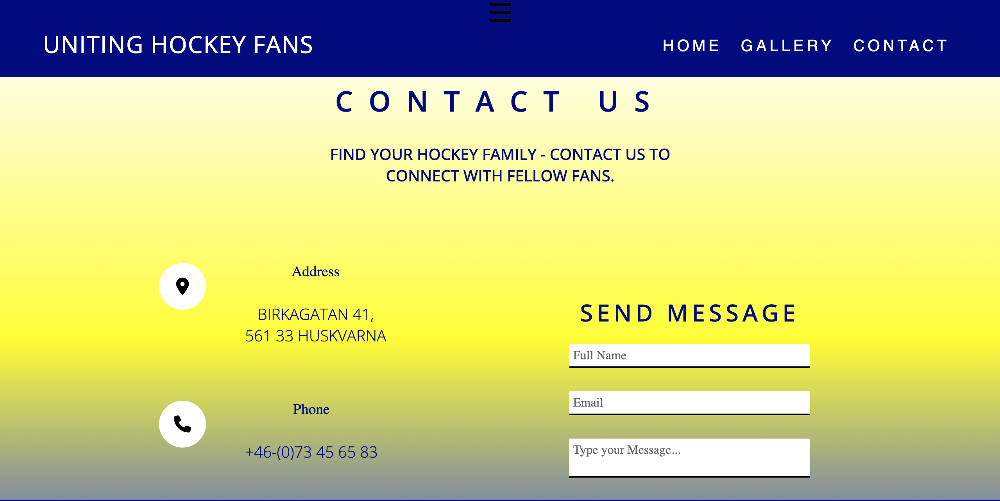
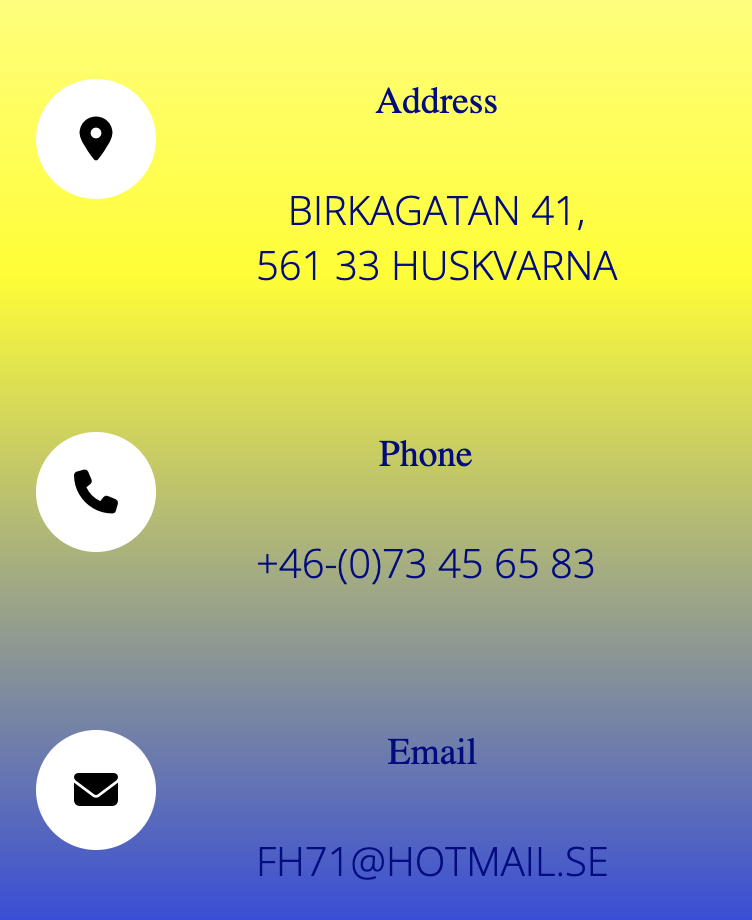
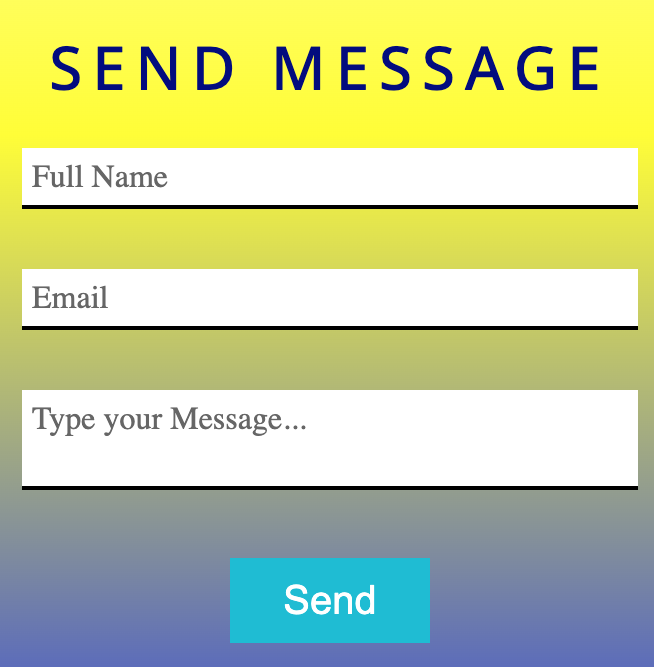
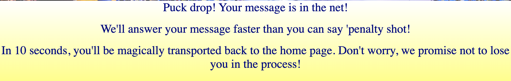

### Uniting Hockey Fans in Jönköping

The Uniting Hockey Fans in Jönköping page is designed to unite passionate supporters of the local hockey team. On this website, visitors can find comprehensive information about the club's activities, events, and interests. The site offers an intuitive and user-friendly navigation experience, enabling users to easily explore different sections and stay engaged with the community. For those looking to get in touch, the contact section provides a straightforward way to reach the fan club. Join in celebrating the spirit of hockey with City Name Hockey Fans!

---

### First Time Visitor Goals:

## Understand the Site's Purpose:

* As a newcomer, I want to quickly grasp the main objective of the website, enabling me to learn more about the organization.

## Easy Navigation:

* As a first-time visitor, I want to effortlessly browse through the website, allowing me to locate the content I'm interested in.

### Frequent Visitor Goals:

## Participate in Events and Contests:

* As a frequent visitor, I want to easily find and participate in fan events, contests, and activities, enhancing my engagement with the club.

## Contact the Club Easily:

* As a frequent visitor, I want a straightforward way to contact the club for any inquiries, suggestions, or support, ensuring open communication.

--- 

## Design choices

### Icons

* Icons have been obtained from Font Awesome and are utilized to signify navigation elements on smaller screens and social media links within the footer.

### Fonts

* Open Sans was selected as the primary and only font for the HV71 Hockey FanClub website. This choice was made to ensure a clean, modern, and highly readable presentation throughout all site content. Open Sans is known for its excellent legibility on both web and mobile platforms, which is crucial for our audience who might access the site from various devices. To add a distinctive character to the HV71 Hockey FanClub website, careful consideration was given to the font is with a focus on enhancing readability and aligning with the club's dynamic and sporty aesthetic.

### Colors

* The colors used in this project are yellow, white, and navy blue. These colors were chosen because they represent the team's official colors. Yellow symbolizes energy and excitement, white signifies purity and simplicity, and navy blue conveys strength and reliability. Using these colors helps to visually align the project with the team's brand and spirit.

Below is a description of the colors and their respective applications

* #000080 - This color will be used for the header, footer, text paragraphs in the 3 pages of the website and part of the gradient-linear in the content area.
* #ffffff - This color will be used  for the nav-bar menu, logo text, social-networks icons, banner-text and part of the gradient-linear of the content-area.
* #ffff00 - This color will be used for the nav.hoger color for the nav-menu text,social networks icons and part of the gradient-linear of the content-area.
* #e91e63 - This color will be used for the contact-box section changin the color of the text inside the contact-box.
* #00bcd4 - This color will be used for the text sections Address, Email, Telephone in the contact page.

## Nav-Bar Description

### Nav-Bar

* The navigation bar is fixed at the top of the screen, offering easy access to various sections of the site. It is fully responsive to different screen sizes, transitioning from a hamburger-style dropdown menu to a horizontal list on larger screens. Additionally, it prominently showcases the website's logo to immediately attract the user's attention.

   * Desktop 
     * The navigation bar stretches across the full width of the device and includes links to navigate to various sections of the site. This ensures straightforward and transparent access to all the content for the user.

     *Navbar Desktop* 

     

   * The links will change color when the user hovers over them to improve visibility.

   *Navbar hover*  

     

   * Small devices (<992px)
     * As the screen size gets smaller, the navigation menu becomes too lengthy to fit within the navbar and still look good. Hence, on smaller devices, the navigation menu will be toggled on and off using a hamburger icon. When activated, the navigation menu will be displayed as a dropdown list.

     *Navbar Small* 

     

     *Navbar dropdown* 

     

## Pages Description 

### Home Page 

* The home section of the HV7 Hockey Club website captures the excitement and energy of hockey, immediately drawing users into the club's vibrant community. A captivating photograph of a packed hockey arena, full of fans and game atmosphere.

## Club Description

* A concise description highlights the club's mission to create a fun and inclusive environment for hockey enthusiasts of all levels. It emphasizes community, teamwork, and a shared love for the game.

 

## Logo and Branding

 * Our emblem, the bull, symbolizes the fighting spirit of HV71. we are a team that never surrenders, always striving to conquer, and embrace the electrifying energy of the exhilarating game nights.

 

 ##  Video Feature

 * A featured video from a recent hockey game captures the excitement of live play and the camaraderie among players and fans, further engaging visitors and inspiring them to join the club.

 

 [video](https://www.youtube.com/watch?v=a7cLPHQ8zSw&embeds_referring_euri=https%3A%2F%2F8000-yuss76a-unitinghockeyfa-yhkls5tuyp6.ws.codeinstitute-ide.net%2F&source_ve_path=MjM4NTE)

 ### Gallery Page

 * The Gallery page of the HV7 Hockey Club website offers an immersive visual experience, showcasing the heart and soul of the club through a curated collection of photos.

 

 ## Player and Game Photos

 * The gallery includes a variety of photos capturing players in action and significant game moments. These images celebrate the skill, teamwork, and excitement that define HV7 Hockey Club.

 

 ## Image Descriptions

 * Each image is accompanied by a description that provides context and interesting facts about the club's history, enhancing the viewer's connection to the club.

 

### Contact Page

* Our contact page provides all the essential details you need to connect with us. It includes:

## Fan Club Address, Email and Telephone 

* Our contact page gives you all the essential details to connect with us, including the fan club's email, phone number, and address! We invite you to reach out, share your thoughts, and be part of our vibrant hockey family. Don’t hesitate to join us in celebrating the thrill of the game!.

## Contact Box 

* A convenient form for you to easily share your inquiries or feedback.

## Contact Us Message

* Additionally, the page features an inviting message encouraging everyone to join our passionate hockey family and be part of the incredible fan club community!

### Response Page

* The last page, which is not visible in the navigation menu, is the response page. This is the page you reach after filling out the contact box and sending us your message. Here, you'll find confirmation of your message submission

### Footer 

* The footer of the page is designed to align with the page header for visual consistency.

* It includes social network links associated with the hockey fans club.

* When clicked, these links will open in a new tab, allowing the customer to stay on the hockey fans club page.

* There is a hover color effect that changes the links to a different color when you hover your mouse over them.

## Used Technologies

### Languages

* [CSS](https://en.wikipedia.org/wiki/CSS "CSS")
* [HTML](https://en.wikipedia.org/wiki/HTML "HTML")

### Libraries & Framework

* [Google Fonts](https://fonts.google.com "Google Fonts")
* [Font Awesome](https://fontawesome.com "Font Awesome")

### Tools

* [GitHub](https://github.com "GitHub")
* [Gitpod](https://gitpod.io "Gitpod")
* [W3C Markup Validation](https://validator.w3.org/#validate_by_input "W3C Markup Validation")
* [W3C CSS Validation](https://jigsaw.w3.org/css-validator/#validate_by_input "W3C CSS Validation")

## Deployment

The site was deployed using GitHub. The steps for deployment are as follows:

1. Go to the repository for your GitHub project.
2. Click on the settings tab.
3. Select page settings under Code and automation.
4. In the Build and deployment section, choose Deploy from branch as the source.
5. Make sure the main branch is selected and then click save.
6. Once these steps are completed, the page should go live within a few minutes.
7. You will be able to view your live project at http://your-username.github.io/your-project-title/.

## Credits

* Header Background Image

- [Banner-area Image](https://pbs.twimg.com/media/DX_gYhWWsAACvoN?format=jpg&name=4096x4096)

* HV71 Video 

- [HV71 Intro Video](https://www.youtube.com/watch?v=a7cLPHQ8zSw)

* Gallery Images 

- [Stefan Liv](https://www.aktuellanyheteriveckan.se/nyheter/p-jnkpingsgalan-kommer-a6-center-auktionera-utstefan-livs-guldklubba)

- [Champions Image](https://idrottensaffarer.se/event/2017/05/sm-guld-ger-klirr-i-kassan)

- [Kids Playing Photo](https://www.hv71.se/hockeyskolan)

- [HV71 Arena](https://jkpg.com/en/jonkoping-huskvarna/hv71-home-games/)

- [Nort Bank Tifo](https://www.jp.se/2021-11-13/har-ar-hv71-fansens-maktiga-hyllningstifo-haftigaste-nagonsin)

- [Jönköping Air photo](https://www.vatterleden.se/en/jonkoping-granna/)

- [HV71 Skolan Kids](https://www.hv71.se/article/a9etalgou-3iaijd/view)

- [O'Learys Pub](https://www.jp.se/artikel/olearys-och-gladje-varslar-och-permitterar-alla-anstallda)

## Acknowledgments

- [Fatme Ali](https://www.linkedin.com/in/fatme-ali-795233160/)Special thanks to my wonderful wife for her unwavering support and encouragement during the difficult moments of this project, making every challenge easier to overcome.

- [Iuliia Konovalova](https://github.com/IuliiaKonovalova)A heartfelt thank you to my mentor for your extraordinary insights and encouragement, which have propelled me forward and shaped my journey throughout this project in ways I will always cherish.

- [Kevin Powell](https://www.youtube.com/@KevinPowell)Special thanks to Kevin Powell for his incredibly helpful videos and tutorials, which have served as invaluable resources throughout this project, guiding me with clarity and inspiration every step of the way.

- [Code Institute](https://codeinstitute.net/global/)Special thanks to the Code Institute, along with the dedicated tutors and mentors in the Slack community, for your unwavering support and guidance; your expertise and encouragement have been instrumental in my learning journey and the success of this project.

- [Emin Shukriev]Special appreciation goes to my friend Emin for being an incredible source of support during this project; your help, insights, and encouragement have been truly transformative and made this journey so much more enjoyable.

- [Martin Hellberg]A special thanks to my coworker Martin for introducing me to the city's hockey team and sharing a new sport that captivated me from the very beginning; your enthusiasm and guidance have enriched my experience and sparked a passion I never knew I had.

