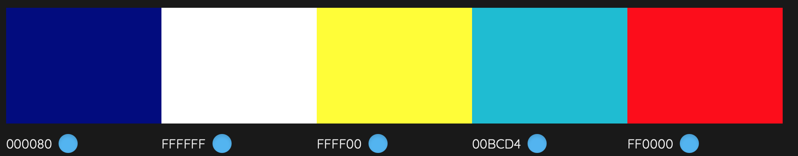

### Uniting Hockey Fans in Jönköping

The Uniting Hockey Fans in Jönköping page is designed to unite passionate supporters of the local hockey team. On this website, visitors can find comprehensive information about the club's activities, events, and interests. The site offers an intuitive and user-friendly navigation experience, enabling users to easily explore different sections and stay engaged with the community. For those looking to get in touch, the contact section provides a straightforward way to reach the fan club. Join in celebrating the spirit of hockey with City Name Hockey Fans!

---

### First Time Visitor Goals:

## Understand the Site's Purpose:

* As a newcomer, I want to quickly grasp the main objective of the website, enabling me to learn more about the organization.

## Easy Navigation:

* As a first-time visitor, I want to effortlessly browse through the website, allowing me to locate the content I'm interested in.

### Frequent Visitor Goals:

## Participate in Events and Contests:

* As a frequent visitor, I want to easily find and participate in fan events, contests, and activities, enhancing my engagement with the club.

## Contact the Club Easily:

* As a frequent visitor, I want a straightforward way to contact the club for any inquiries, suggestions, or support, ensuring open communication.

--- 

## Design choices

### Icons

* Icons have been obtained from Font Awesome and are utilized to signify navigation elements on smaller screens and social media links within the footer.

### Fonts

* Open Sans was selected as the primary and only font for the HV71 Hockey FanClub website. This choice was made to ensure a clean, modern, and highly readable presentation throughout all site content. Open Sans is known for its excellent legibility on both web and mobile platforms, which is crucial for our audience who might access the site from various devices. To add a distinctive character to the HV71 Hockey FanClub website, careful consideration was given to the font is with a focus on enhancing readability and aligning with the club's dynamic and sporty aesthetic.

### Colors

* The colors used in this project are yellow, white, and navy blue. These colors were chosen because they represent the team's official colors. Yellow symbolizes energy and excitement, white signifies purity and simplicity, and navy blue conveys strength and reliability. Using these colors helps to visually align the project with the team's brand and spirit.

Below is a description of the colors and their respective applications

